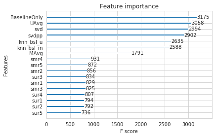
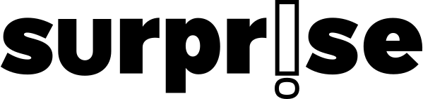

* # Netflix Recommendation - Implementation of Prize winner's solution

- [Overview:](#overview)
- [Feature Extraction](#feature-extraction)
  - [1. Baseline](#1-baseline)
  - [2. KNNBaseline predictor](#2-knnbaseline-predictor)
  - [3. SVD](#3-svd)
  - [4. SVD++](#4-svd)
- [Key aspects](#key-aspects)
- [Best Model](#best-model)
  - [Feature Importance](#feature-importance)
- [Technologies Used:](#technologies-used)
- [Credits](#credits)
- [Creator:](#creator)


## Overview:

source: https://www.kaggle.com/netflix-inc/netflix-prize-data

Netflix is all about connecting people to the movies they love. To help customers find those movies, they developed world-class movie recommendation system: CinematchSM. Its job is to predict whether someone will enjoy a movie based on how much they liked or disliked other movies. Netflix use those predictions to make personal movie recommendations based on each customer’s unique tastes. And while Cinematch is doing pretty well, it can always be made better.

The movie rating files contain over 100 million ratings from 480 thousand randomly-chosen, anonymous Netflix customers over 17 thousand movie titles. The data were collected between October, 1998 and December, 2005 and reflect the distribution of all ratings received during this period.  The ratings are on a scale from 1 to 5 (integral) stars. To protect customer privacy, each customer id has been replaced with a randomly-assigned id.  The date of each rating and the title and year of release for each movie id are also provided.

CustomerID,Rating,Date

- MovieIDs range from 1 to 17770 sequentially.
- CustomerIDs range from 1 to 2649429, with gaps. There are 480189 users.
- Ratings are on a five star (integral) scale from 1 to 5.
- Dates have the format YYYY-MM-DD.

## Feature Extraction

Source: https://surprise.readthedocs.io/en/stable/prediction_algorithms_package.html

Basic features like Global average of all movie ratings, Average rating per user, and Average rating per movie, top 5 similar users and movies ratings. Apart from these Predictions from following Machine learning models are added.

### 1. Baseline  
__Predicted_rating : ( baseline prediction )__
  


-  :  Average of all ratings in training data.
*  : User bias
*  : Item bias (movie biases)


**Solved using Optimization function (Least Squares Problem)**:


### 2. KNNBaseline predictor
 **based on User-User and movie-movie similarity**


-  -  _Baseline prediction_ of (user,movie) rating

-  - Set of __K similar__ users (neighbours) of __user (u)__ who rated __movie(i)__  

- _sim (u, v)_ - __Similarity__ between users __u and v__  
    - Generally, it will be cosine similarity or Pearson correlation coefficient. 
    - But we use __shrunk Pearson-baseline correlation coefficient__, which is based on the pearsonBaseline similarity (we take base line predictions instead of mean rating of user/item)

__similarly Predicted rating based on Item Item similarity:__
  


### 3. SVD

__Predicted Rating :__


    
-  - Representation of item(movie) in latent factor space
-  - Representation of user in new latent factor space

__Optimization problem with user item interactions and regularization (to avoid overfitting)__


### 4. SVD++

__Predicted Rating :__


-  - the set of all items rated by user u

-  - Our new set of item factors that capture implicit ratings.
   
__Optimization problem with user item interactions and regularization (to avoid overfitting)__


## Key aspects

* Since ```date```  feature available on which rating were given Train and Test data were splited based on time in 80:20 ratio. 
* The models were trained on sample data of size 100000. In Test data, only those users and movies sampled that are appeared atleast once in the trainset.

## Best Model
Predictions from baseline models and manually extracted features are fit against ratings using **Xgboost** algorithm. Best model achived an **RMSE** of **0.967** on test data.

```py
{'n_estimators': 250,
  'learning_rate': 0.05,
  'max_depth': 6,
  'min_child_weight': 3,
  'gamma': 0.2,
  'colsample_bytree': 0.3,
  'eta': 0.1}
  ```


### Feature Importance



## Technologies Used:


[](https://scikit-learn.org/stable/#)
[](https://scikit-learn.org/stable/#)
 
 ## Credits
 * https://www.kaggle.com/netflix-inc/netflix-prize-data
* Netflix blog: https://medium.com/netflix-techblog/netflix-recommendations-beyond-the-5-stars-part-1-55838468f429
* surprise library: http://surpriselib.com/ (we use many models from this library)
* surprise library doc: http://surprise.readthedocs.io/en/stable/getting_started.html (we use many models from this library)
* installing surprise: https://github.com/NicolasHug/Surprise#installation
* Research paper: http://courses.ischool.berkeley.edu/i290-dm/s11/SECURE/a1-koren.pdf (most of our work was inspired by this paper)
 
</br>

------
## Creator:
[](https://skumar-djangoblog.herokuapp.com/)